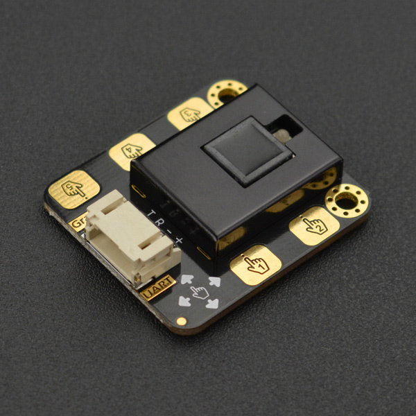

# DFRobot_Gesture_Touch

- [中文版](./README_CN.md)

This sensor module integrates gesture and touch recognition functions in one piece, and provides an adjustable detection range within 0-30cm. When connected to your micro-controller, it can detect 5-way touch signal and 7 kinds of gestures: move right, move left, move backward, move forward, pull down, pull up, pull and remove. Besides, the sensor is also equipped with the function of auto-sleep and wake-up. <br/>

The module comes with the gesture recognition algorithm and provides simple and reliable data output. Use the sensor to directly communicate with upper computer or micro-controllers like Arduino and Raspberry Pi via serial port. This sensor can be used to make a smart lamp, DIY intelligent car, and used in interactive projects or fun games requiring gesture recognition. The onboard 5-way touch pad on the sensor can be directly used to detect touch, or you can extend the touch pad with wires to make it perfectly fit your application.



## Product Link(https://www.dfrobot.com.cn/goods-1994.html)

    SKU：SEN0285

## Table of Contents

* [Summary](#summary)
* [Installation](#installation)
* [Methods](#methods)
* [Compatibility](#compatibility)
* [History](#history)
* [Credits](#credits)

## Summary

An Arduino library for the Gravity: Gesture & Touch Sensor.

## Installation

To use this library download the zip file, uncompress it to a folder named DFRobot_Gesture_Touch.
Download the zip file first to use this library and uncompress it to a folder named DFRobot_Gesture_Touch.

## Methods

```C++

  /**
   * @fn setGestureDistance
   * @brief Set the Gesture Distance 
   * @param dis Distance
   */
  void    setGestureDistance(uint8_t dis);

  /**
   * @fn setSleep
   * @brief set auto sleep time out, in sleep mode, something approaching will wake it up
   * @param sec time  
   */
  void    setSleep(uint8_t sec);

  /**
   * @fn enableFunction
   * @brief Set which gestures the sensor recognizes
   * @param func function number
   */
  void    enableFunction(uint16_t func);

  /**
   * @fn disableFunction
   * @brief Set which gestures the sensor does not recognize
   * @param func function number
   */
  void    disableFunction(uint16_t func);

  /**
   * @fn getAnEvent
   * @brief Get whether the sensor recognizes a gesture or which button is being touched
   * @return int8_t  event number
   */
  int8_t    getAnEvent(void);
```

## Compatibility

MCU                | Work Well | Work Wrong | Untested  | Remarks
------------------ | :----------: | :----------: | :---------: | -----
FireBeetle-ESP32  |      √       |             |            | 
FireBeetle-ESP8266|      √       |              |             | 
Mega2560  |      √       |             |            | 
Arduino uno |       √      |             |            | 
Leonardo  |      √       |              |             | 
Micro：bit  |      √       |              |             | 
M0  |      √       |              |             | 

## History

- 2022/3/29 - Version 1.0.0 

## Credits

Written by PengKaixing(kaixing.peng@dfrobot.com), 2021. (Welcome to our [website](https://www.dfrobot.com/))
