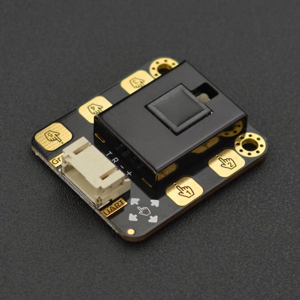

# DFRobot_Gesture_Touch

- [中文版](./README_CN.md)

This sensor module integrates gesture and touch recognition functions in one piece, and provides an adjustable detection range within 0-30cm. When connected to your micro-controller, it can detect 5-way touch signal and 7 kinds of gestures: move right, move left, move backward, move forward, pull down, pull up, pull and remove. Besides, the sensor is also equipped with the function of auto-sleep and wake-up.

The module comes with the gesture recognition algorithm and provides simple and reliable data output. Use the sensor to directly communicate with upper computer or micro-controllers like Arduino and Raspberry Pi via serial port. This sensor can be used to make a smart lamp, DIY intelligent car, and used in interactive projects or fun games requiring gesture recognition. The onboard 5-way touch pad on the sensor can be directly used to detect touch, or you can extend the touch pad with wires to make it perfectly fit your application.


## Product Link(https://www.dfrobot.com.cn/goods-1994.html)

SKU：SEN0285

## Table of Contents

* [Summary](#summary)
* [Installation](#installation)
* [Methods](#methods)
* [Compatibility](#compatibility)
* [History](#history)
* [Credits](#credits)

## Summary

An microPython library for the Gravity: Gesture & Touch Sensor.

## Installation

To use this library, first download the library to ESP32 using UPY, then open the routines folder. To execute a routine i2c_read_write.py, type python i2C_read_write.py on the command line .

## Methods

```python
  '''!
    @brief Set the Gesture Distance 
    @param dis Distance
  '''
  def set_gesture_distance(self,dis):

  '''
    @brief set auto sleep time out, in sleep mode, something approaching will wake it up
    @param sec time  
  '''
  def set_sleep(self,sec):

  '''
    @brief Set which gestures the sensor recognizes
    @param func function number
  '''
  def enable_function(self, func):

  '''
    @brief Set which gestures the sensor does not recognize
    @param func function number
  '''
  def disable_function(self, func):

  '''
    @brief Get whether the sensor recognizes a gesture or which button is being touched
    @return int8_t  event number
  '''
  def get_an_event(self):

  '''
    @brief  set command
    @param  cmd command
    @param  value parameter setting
  '''
  def set(self, cmd, value):

  ''' 
    @brief Enable some sensor functions
    @param  start Enable or not
    @param  Sensor functions to be enabled
  '''
  def enable_function_helper(self , start,  func):  
```

## Compatibility

| Mainboard         | Pass | Miss | No Test | Note |
| ------------ | :--: | :----: | :----: | :--: |
| ESP32 |  √   |        |        |      |

## History

- 2022/3/29 - 1.0.0 Version

## Credits

Written by PengKaixing(kaixing.peng@dfrobot.com), 2021. (Welcome to our [website](https://www.dfrobot.com/))
