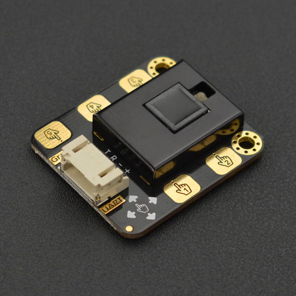

# DFRobot_Gesture_Touch

- [English Version](./README.md)

这款是一款集成了手势识别功能和触摸识别功能的传感器模块，它的最大检测距离为30cm，距离0-30cm可调。其中，能够识别向右、向左、向后、向前、下压、上拉及上拉下压后手松开共7种手势，以及5路的触摸信号，并具有自动睡眠和唤醒的功能。
模块自带手势识别算法，输出数据简洁可靠，可通过串口直接与arduino及树莓派等控制器或上位机通讯。用于智能灯、人机交互、智能小车、趣味游戏等多功能远距离手势控制端。传感器板载5路触摸片，不仅可以直接实现触摸还可以利用导线连接方式延长触摸端。



## 产品链接(https://www.dfrobot.com.cn/goods-1994.html)

    SKU：SEN0285

## 目录

* [概述](#概述)
* [库安装](#库安装)
* [方法](#方法)
* [兼容性](#兼容性y)
* [历史](#历史)
* [创作者](#创作者)

## 概述

兼容Arduino平台的手势检测和触摸检测的传感器库

## 库安装

要使用这个库，首先使用UPY将库下载到ESP32，然后打开例程文件夹。要执行一个例程i2c_read_write.py，请在命令行中输入python i2c_read_write.py。

## 方法

```python
  '''!
    @brief Set the Gesture Distance 
    @param dis Distance
  '''
  def set_gesture_distance(self,dis):

  '''
    @brief set auto sleep time out, in sleep mode, something  approach will weak it up
    @param sec time  
  '''
  def set_sleep(self,sec):

  '''
    @brief enable function 
    @param func function number
  '''
  def enable_function(self, func):

  '''
    @brief disenable function
    @param func function number
  '''
  def disable_function(self, func):

  '''
    @brief Get the Event
    @return int8_t  event number
  '''
  def get_an_event(self):

  '''
    @brief  set command
    @param  cmd command
    @param  value parameter setting
  '''
  def set(self, cmd, value):

  ''' 
    @brief Enable some sensor functions
    @param  start Enable or not
    @param  Sensor functions to be enabled
  '''
  def enable_function_helper(self , start,  func):  

```

## 兼容性

| Mainboard         | Pass | Miss | No Test | Note |
| ------------ | :--: | :----: | :----: | :--: |
| ESP32 |  √   |        |        |      |

## 历史

- 2022/3/29 - 1.0.0 版本

## 创作者

Written by PengKaixing(kaixing.peng@dfrobot.com), 2021. (Welcome to our [website](https://www.dfrobot.com/))